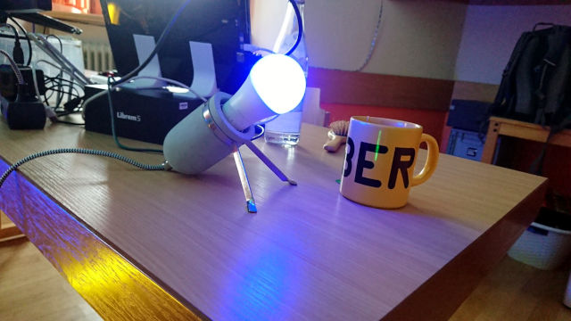
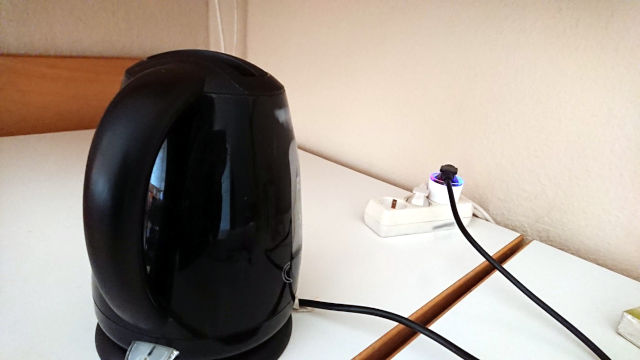

# Session Teelicht (tea light)

During our hacking events we often had the problem, that when someone started
the water kettle in the other room to make tea, and forgot about it while
chatting with other pople. Then they had to start the kettle again ... and
maybe forget it again.

To solve this, I did a small IoT-Setup, that was meant to solve this problem.

## Parts required:

These are the parts we used. It should also work with other devices, but then you have
to adapt the MQTT commands used in the code.

- a wifi power plug with power measurement (Shelly Plug S)
- a wifi RGB light bulb (Shelly Duo RGBW)
- a computer to run the MQTT broker and this script (Raspberry PI)
- a network with a wifi access point

*TODO: make devie specific code configurable ...*

## Setup:

*TODO: ...*

